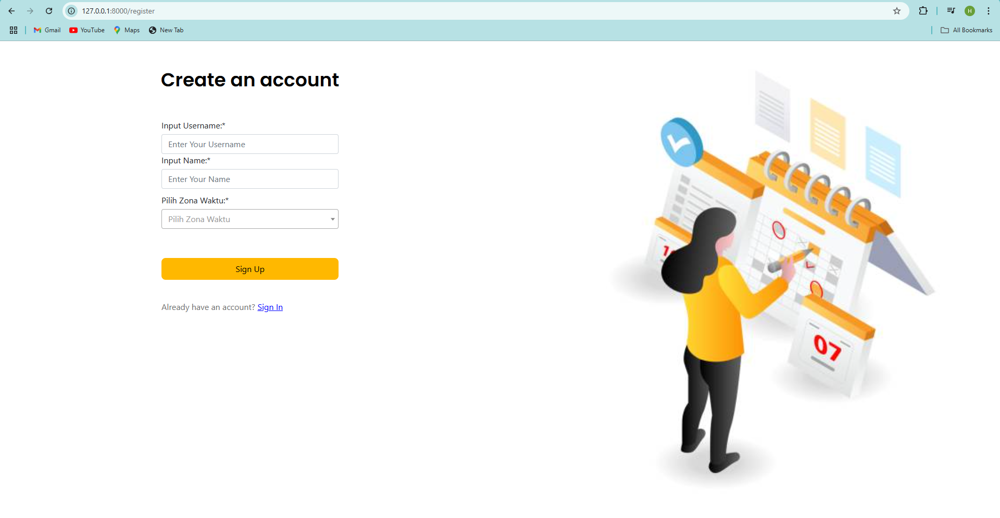

# User Appointment Management

A Laravel-based User Appointment Management System with timezone handling.

## Screenshots

### Sign In Page

### Sign Up Page

### List of User in Appointments

### List of Appointments

### Meeting Details

### Add Meeting

### Edit Meeting

### User Not Found

### Page Expired

## 🎥 Demo Video
📹 [Klik di sini untuk melihat video]([https://drive.google.com/your-video-link](https://drive.google.com/file/d/1EwOdoRr7e0KF8QvOcGxnAvPDOvGqz2mY/view?usp=sharing))  
